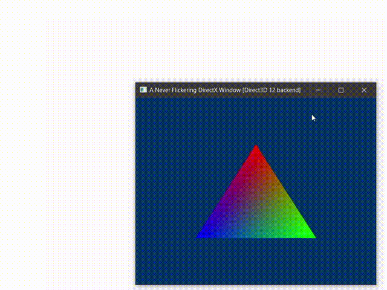

# A Never Flickering Direct3D 11/12 Window POC
This application is originated from a [solution posted on gamedev.net](https://www.gamedev.net/forums/topic/708865-dxgi-flip-model-flickering-during-live-resize/) by the user named [jbatez](https://www.gamedev.net/jbatez):

The original annotation:
>For years now I've had this annoying little problem where the right and bottom edges of windows backed by DXGI flip model swap chains flicker during live window resizing (e.g. when grabbing the bottom right corner of a window and dragging). I've tried dozens if not hundreds of different techniques and today I finally stumbled on one that works!

    <table>
     <tr>
        <td style="width: 50%; border:none; border-collapse:collapse;"></td>
        <td style="border:none; border-collapse:collapse;">
The original code provided was built upon DirectX 11 API and included only empty screen rendering. I added some features to it:

* The classic "rainbow triangle" render
* DirectX 12 backend

     
</tr>
    </table>

The original solution description by [jbatez](https://www.gamedev.net/jbatez):

>TLDR:
>
>Step 1. Use CreateSwapChainForComposition() instead of CreateSwapChain()/CreateSwapChainForHwnd().
>
>Step 2. Call ResizeBuffers() in WM_NCCALCSIZE instead of WM_SIZE.
>
>Step 3. Render and present a new frame before returning from WM_NCCALCSIZE.
The long answer:
>
>Grab a modern graphics-accelerated application window (e.g. Steam) by the bottom right corner and drag. You see nasty flickering with black and/or white lines, right? This flickering has haunted me for years. Every time I tried to use the DXGI flip model, no matter what I did, no matter what API's I called in what order or however careful I was with synchronization, I always encountered graphical glitches like this.
>
>Now try the same thing with an ancient application (e.g. Notepad). It's beautiful. No glitches at all. Clearly it's possible to get this right. What the heck's going on?
>
>I have no idea what actually causes this. I've seen it happen on AMD and NVIDIA graphics cards, so I doubt it's a driver problem. I assume it has something to do with how DWM synchronizes with DXGI-based apps, but since it's all closed source and Microsoft's documentation is light on details, it's hard to know for sure.
>
>I recently came across this (https://docs.microsoft.com/en-us/archive/msdn-magazine/2014/june/windows-with-c-high-performance-window-layering-using-the-windows-composition-engine) little gem of an article and decided to give DirectComposition a try. I'd heard of DirectComposition before, but it's documentation makes it sound like it's meant for GUI-based applications with fancy animations, not games that just want an efficient way to get their pixels on the screen.
>
>DirectComposition gave me similar issues at first. Instead of black and white flickering I was seeing through temporary gaps in the window to the desktop behind. And it was dragging from the top/left edges instead of the bottom/right that was causing problems. But these were totally new problems I'd never seen before, so I kept trying.
>
>I stuck with it and, lo and behold, I found a technique that works! The trick is to resize your swap chain buffers and present a frame BEFORE the window actually resizes. In my case, that meant using WM_NCCALCSIZE instead of WM_SIZE. I've tried this before with a CreateSwapChainForHwnd() swap chain, but for some reason this technique only works when using DirectComposition. Example code below.
>
>Be warned: I've read bug reports of capture software not working with DirectComposition. It sounds like there are workarounds, though, so it's probably just a matter of software catching up and becoming DirectComposition-aware.

Although, the application claims that it never flickers, alas, I managed to find a system (a Chinese laptop with i7-1195G7 + integrated GPU + Windows 10 aboard) on which it slightly flickers on resize. But it seems to be an unfortunate GPU/drivers behaviour which Intel is famous for...</td>
